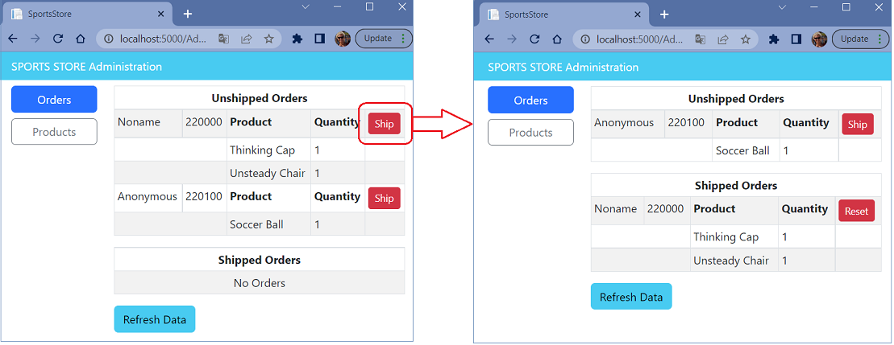
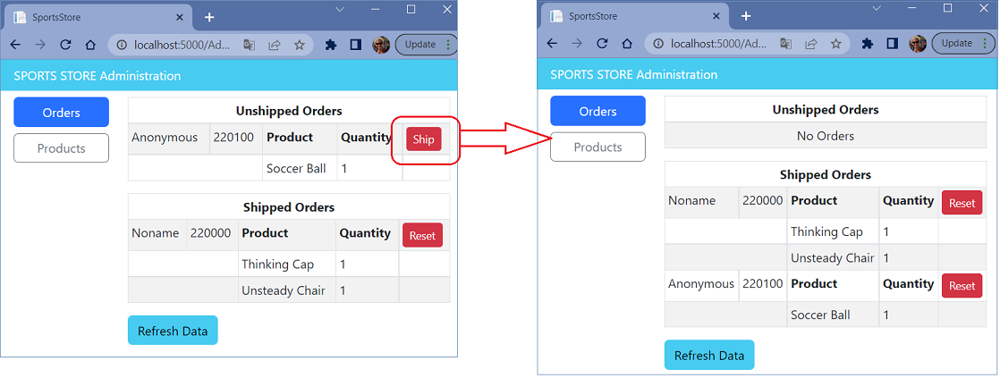
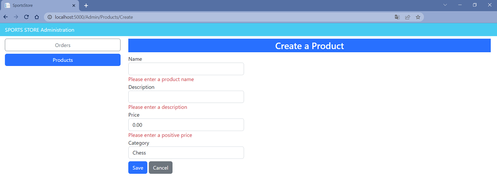
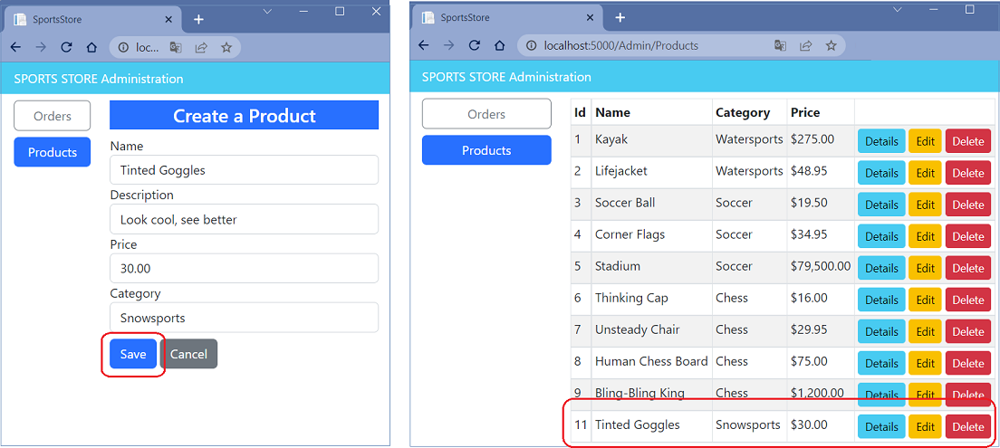
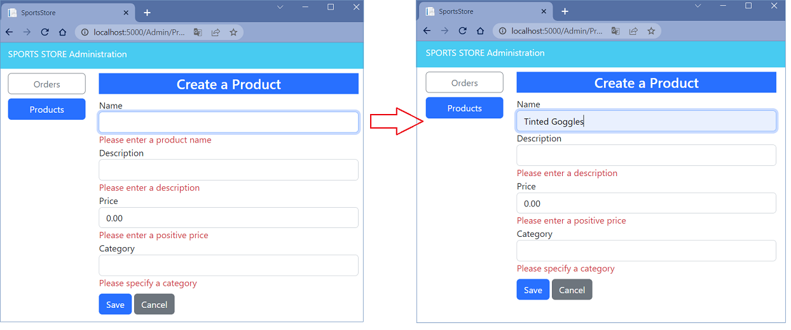

# Sports Store Application. Part 4

## Description

Implementation of CRUD operations that allow the administrator to create, read, update and delete products from repository and mark orders as shipped.

## Implementation details

<details>
<summary>

**Managing Orders**
</summary>

- Go to the cloned repository of the previous step `Sport Store Application. Part 3`. 

- Switch to the `sports-store-application-4` branch and do a fast-forward merge according to changes from the `main` branch.

```
$ git checkout sports-store-application-4

$ git merge main --ff

```
- Continue your work in Visual Studio or other IDE.

- Build project, run application and request http://localhost:5000/. All functionalities implemented in the previous step should work.

- Create and add to `Controllers` folder a separate `AdminController` controller class for managing orders shipping and the product catalog.

```
using Microsoft.AspNetCore.Mvc;
using SportsStore.Models;
using SportsStore.Models.Repository;

namespace SportsStore.Controllers
{
    [Route("Admin")]
  ➥public class AdminController : Controller
    {
        private IStoreRepository storeRepository;
        private IOrderRepository orderRepository;

        public AdminController(IStoreRepository storeRepository, IOrderRepository orderRepository) 
            => (this.storeRepository, this.orderRepository) = (storeRepository, orderRepository);

        [Route("Orders")]
        public ViewResult Orders() => View(orderRepository.Orders);

        [Route("Products")]
        public ViewResult Products() => View(storeRepository.Products);
    }
}

```
`In the future a routing attributes will be used to routing support.`

- Add the `AdminNavigationMenuViewComponent.cs` class file to `Components` folder.

```
using Microsoft.AspNetCore.Mvc;

namespace SportsStore.Components
{
  ➥public class AdminNavigationMenuViewComponent : ViewComponent
    {
        public IViewComponentResult Invoke()
        {
            ViewBag.Selection = Request.Path.Value ?? "Products";

            return View(new string[] { "Orders", "Products" });
        }
    }
}
```
- Add the `Default.cshtml` Razor View file in the `Views/Shared/Components/AdminNavigationMenu` folder.

```
@model IEnumerable<string>

<div class="d-grid gap-2">
    @foreach (string category in Model)
    {
        <a class="btn @(((string)ViewBag.Selection).Contains(category) ? "btn-primary" : "btn-outline-secondary")"
           asp-action="@category" asp-controller="Admin">
            @category
        </a>
    }
</div>
```
- To create the layout view for the administration tools, add to the `Views/Admin` folder a `_AdminLayout.cshtml` Layout Razor View.  
```
<!DOCTYPE html>
<html>
<head>
    <meta name="viewport" content="width=device-width" />
    <title>SportsStore</title>
    <link href="/lib/bootstrap/css/bootstrap.min.css" rel="stylesheet" />
</head>
<body>
    <div class="bg-info text-white p-2">
        <div class="container-fluid">
            <span class="navbar-brand">SPORTS STORE Administration</span>
        </div>
    </div>
    <div class="container-fluid">
        <div class="row p-2">
            <div class="col-3">
                <vc:admin-navigation-menu />
            </div>
            <div class="col-9">
                @RenderBody()
            </div>
        </div>
    </div>
</body>
</html>
```
- To complete the initial setup, add the views that will provide the administration tools, although they will contain placeholder messages at first. Add a `Orders.cshtml` Razor View file to the `Views/Admin` folder with the content shown below.

```
@model IQueryable<Order>

@{
    Layout = "_AdminLayout";
}

<h4>This is the orders information.</h4>
```
and add a `Products.cshtml` Razor View file to the `Views/Admin` folder with the content shown below.

```
@model IQueryable<Product>

@{
    Layout = "_AdminLayout";
}

<h4>This is the products information.</h4>

```
- Build project, run application and request http://localhost:5000/Admin/Orders 


and http://localhost:5000/Admin/Products.


- To create a simple administration tool that will let to view the orders that have been received and mark them as shipped, at first change the data model so that adminstator can record which orders have been shipped. Add a `Shipped` property in the `Order` class (the `Order.cs` file in the `Models` Folder)

```
using System.ComponentModel.DataAnnotations;
using Microsoft.AspNetCore.Mvc.ModelBinding;

namespace SportsStore.Models
{
    public class Order
    {
        . . .

        [BindNever]
      ➥public bool Shipped { get; set; }

        . . .
    }
}

```
- To update the database to reflect the addition of the `Shipped` property to the `Order` class, open a new command prompt or PowerShell window, navigate to the SportsStore project folder and run the following command: 

```
dotnet ef migrations add ShippedOrders

```
_The migration will be applied automatically when the application is started and the `SeedData` class calls the `Migrate` method provided by Entity Framework Core._

- Add to `AdminController` class `MarkShipped` method that will be receive a POST request that specifies the Id of an order, which is used to locate the corresponding `Order` object from the repository so that the `Shipped` property can be set to `true` and saved and  `Reset` method  that will be receive a POST request that specifies the `Id` of an order, which is used to locate the corresponding `Order` object from the repository so that the `Shipped` property can be set to `false` and saved

```
using Microsoft.AspNetCore.Mvc;
using SportsStore.Models;
using SportsStore.Models.Repository;

namespace SportsStore.Controllers
{
    [Route("Admin")]
    public class AdminController : Controller
    {
        . . .

        [HttpPost]
        [Route("MarkShipped")]
      ➥public IActionResult MarkShipped(int orderId)
        {
            Order? order = orderRepository.Orders.FirstOrDefault(o => o.OrderId == orderId);

            if (order != null)
            {
                order.Shipped = true;
                orderRepository.SaveOrder(order);
            }

            return RedirectToAction("Orders");
        }

        [HttpPost]
        [Route("Reset")]
      ➥public IActionResult Reset(int orderId)
        {
            Order? order = orderRepository.Orders.FirstOrDefault(o => o.OrderId == orderId);

            if (order != null)
            {
                order.Shipped = false;
                orderRepository.SaveOrder(order);
            }

            return RedirectToAction("Orders");
        }
    }
}
```
- To avoid duplicating code and content, create and add to the `Views/Order` folder a `_OrderTable.cshtml` Razor Partial View that displays a table without knowing which category of order it is dealing with the content shown below

```
@model (IQueryable<Order> Orders, string TableTitle, string ButtonLabel, string CallbackMethodName)

<table class="table table-sm table-striped table-bordered">
    <thead>
        <tr><th colspan="5" class="text-center">@Model.TableTitle</th></tr>
    </thead>
    <tbody>
        @if (Model.Orders.Any())
        {
            @foreach (Order o in Model.Orders)
            {
                <tr>
                    <td>@o.Name</td>
                    <td>@o.Zip</td>
                    <th>Product</th>
                    <th>Quantity</th>
                    <td>
                        <form asp-action=@Model.CallbackMethodName method="post">
                            <input type="hidden" name="OrderId" value="@o.OrderId" />
                            <button type="submit" class="btn btn-sm btn-danger">
                                @Model.ButtonLabel
                            </button>
                        </form>
                    </td>
                </tr>
                @foreach (CartLine line in o.Lines)
                {
                    <tr>
                        <td colspan="2"></td>
                        <td>@line.Product.Name</td>
                        <td>@line.Quantity</td>
                        <td></td>
                    </tr>
                }
            }
        }
        else
        {
            <tr><td colspan="5" class="text-center">No Orders</td></tr>
        }
    </tbody>
</table>
```
- Change a `Orders.cshtml` Razor View that gets the `Order` data from the database and uses the `_OrderTable.cshtml` Razor Partial View to display it to the user

```
  @model IQueryable<Order>
  
  @{
      Layout = "_AdminLayout";
      var unshippedOrders = Model.Where(o => !o.Shipped);
      var shippedOrders = Model.Where(o => o.Shipped);
  }
  
➥<partial name="_OrderTable" model='(unshippedOrders, "Unshipped Orders", "Ship", "MarkShipped")' />
➥<partial name="_OrderTable" model='(shippedOrders, "Shipped Orders", "Reset", "Reset")' />
  
  <form asp-action="Orders" method="post">
      <button class="btn btn-info">Refresh Data</button>
  </form>
```
- To see your changes, build project, run application and request http://localhost:5000/Admin/Orders.


- To see the new features, request http://localhost:5000, and create an order. Once you have at least one order in the database, request http://localhost:5000/Admin/Orders, and you will see a summary of the order you created displayed in the `Unshipped Orders table`. Click the `Ship` button, and the order will be updated and moved to the `Shipped Orders table`, as shown below





Click the `Reset` button, and the order will be updated and moved to the `Unshipped Orders table`, as shown below


- Add and view changes and than commit.

```
$ dotnet build
$ dotnet run
$ git status
$ git add *.cs *.cshtml *.csproj
$ git diff --staged
$ git commit -m "Managing Orders."

```

</details>

<details>
<summary>

**Adding Catalog Management**

</summary>


- To add the features that allow a administrator to create, modify and delete products add new methods to the `IStoreRepository` interface

```
namespace SportsStore.Models.Repository
{
    public interface IStoreRepository
    {
        IQueryable<Product> Products { get; }

      ➥void SaveProduct(Product p);

      ➥void CreateProduct(Product p);

      ➥void DeleteProduct(Product p);
    }
}

```

- Add implementation of this methods in the `EFStoreRepository` class (in `EFStoreRepository.cs` file in the `SportsStore/Models` folder)

```
namespace SportsStore.Models.Repository
{
    public class EFStoreRepository : IStoreRepository
    {
        private StoreDbContext context;

        public EFStoreRepository(StoreDbContext ctx)
        {
            this.context = ctx;
        }

        public IQueryable<Product> Products => this.context.Products;

      ➥public void CreateProduct(Product p)
        {
            context.Add(p);
            context.SaveChanges();
        }

      ➥public void DeleteProduct(Product p)
        {
            context.Remove(p);
            context.SaveChanges();
        }

      ➥public void SaveProduct(Product product)
        {
            if (product.ProductId == 0)
            {
                context.Products.Add(product);
            }
            else
            {
                Product? dbEntry = context.Products?.FirstOrDefault(p => p.ProductId == product.ProductId);

                if (dbEntry != null)
                {
                    dbEntry.Name = product.Name;
                    dbEntry.Description = product.Description;
                    dbEntry.Price = product.Price;
                    dbEntry.Category = product.Category;
                }
            }

            context.SaveChanges();
        }
    }
}

```
- To validate the values the user provides when editing or creating `Product` objects, add validation attributes to the `Product` data model class

```
using System.ComponentModel.DataAnnotations;
using System.ComponentModel.DataAnnotations.Schema;

namespace SportsStore.Models
{
    public class Product
    {
        public long ProductId { get; set; }

      ➥[Required(ErrorMessage = "Please enter a product name")]
        public string Name { get; set; } = string.Empty;

      ➥[Required(ErrorMessage = "Please enter a description")]
        public string Description { get; set; } = string.Empty;

      ➥[Required]
      ➥[Range(0.01, double.MaxValue, ErrorMessage = "Please enter a positive price")]
        [Column(TypeName = "decimal(8, 2)")]
        public decimal Price { get; set; }

      ➥[Required(ErrorMessage = "Please specify a category")]
        public string Category { get; set; } = string.Empty;
    }
}

```
- To provide the administrator a table of products with links to check, edit and delete, replace the contents of the `Products.cshtml` file with those shown below

```
@model IQueryable<Product>

@{
    Layout = "_AdminLayout";
}

<table class="table table-sm table-striped table-bordered">
    <thead>
        <tr>
            <th>Id</th>
            <th>Name</th>
            <th>Category</th>
            <th>Price</th>
            <td />
        </tr>
    </thead>
    <tbody>
        @if (Model?.Count() > 0)
        {
            @foreach (Product p in Model)
            {
                <tr>
                    <td>@p.ProductId</td>
                    <td>@p.Name</td>
                    <td>@p.Category</td>
                    <td>@p.Price.ToString("c")</td>
                    <td>
                        <a class="btn btn-info btn-sm" asp-controller="Admin" asp-action="Details" asp-route-productId="@p.ProductId">
                            Details
                        </a>
                        <a class="btn btn-warning btn-sm" asp-controller="Admin" asp-action="Edit" asp-route-productId="@p.ProductId">
                            Edit
                        </a>
                        <a class="btn btn-danger btn-sm" asp-controller="Admin" asp-action="Delete" asp-route-productId="@p.ProductId">
                            Delete
                        </a>
                    </td>
                </tr>
            }
        }
        else
        {
            <tr>
                <td colspan="5" class="text-center">No Products</td>
            </tr>
        }
    </tbody>
</table>

<a class="btn btn-primary" asp-controller="Admin" asp-action="Create">Create</a>    
```

- Restart ASP.NET Core and request http://localhost:5000/Admin/Products


- To display all the fields for a single `Product` object add an `Details` action method in the `AdminController` class

```
using Microsoft.AspNetCore.Mvc;
using SportsStore.Models;
using SportsStore.Models.Repository;

namespace SportsStore.Controllers
{
    [Route("Admin")]
    public class AdminController : Controller
    {
        . . .
        [Route("Admin/Details/{productId:int}")]
      ➥public ViewResult Details(int productId)
            => View(storeRepository.Products.FirstOrDefault(p => p.ProductId == productId));
        . . .
}
```
and a `Details.cshtml` Razor View to the `Views/Admin` folder.

```
@model SportsStore.Models.Product?

@{
    Layout = "_AdminLayout";
}

<h3 class="bg-info text-white text-center p-1">Details</h3>

<table class="table table-sm table-bordered table-striped">
    <tbody>
        <tr>
            <th>Id</th>
            <td>@Model?.ProductId</td>
        </tr>
        <tr>
            <th>Name</th>
            <td>@Model?.Name</td>
        </tr>
        <tr>
            <th>Description</th>
            <td>@Model?.Description</td>
        </tr>
        <tr>
            <th>Category</th>
            <td>@Model?.Category</td>
        </tr>
        <tr>
            <th>Price</th>
            <td>@Model?.Price.ToString("C")</td>
        </tr>
    </tbody>
</table>

<a class="btn btn-warning" asp-controller="Admin" asp-action="Edit" asp-route-productId="@Model?.ProductId">Edit</a>
<a class="btn btn-secondary" asp-controller="Admin" asp-action="Products">Back</a>
```
- Restart ASP.NET Core, request http://localhost:5000/Admin/Products and click `Details` link for some product.


- To implement the abilities to edit and to create of a single `Product` object, add the `Edit` and `Create` action methods accordingly in the `AdminController` class.
```
[Route("Admin")]
public class AdminController : Controller
{
    . . .

    [Route("Products/Edit/{productId:long}")]
  ➥public ViewResult Edit(int productId)
    {
        return View(storeRepository.Products.FirstOrDefault(p => p.ProductId == productId));
    }

    [HttpPost]
    [Route("Products/Edit/{productId:long}")]
  ➥public IActionResult Edit(Product product)
    {
        if (ModelState.IsValid)
        {
            storeRepository.SaveProduct(product);
            return RedirectToAction("Products");
        }

        return View(product);
    }

    [Route("Products/Create")]
  ➥public ViewResult Create()
    {
        return View(new Product());
    }

    [HttpPost]
    [Route("Products/Create")]
  ➥public IActionResult Create(Product product)
    {
        if (ModelState.IsValid)
        {
            storeRepository.SaveProduct(product);
            return RedirectToAction("Products");
        }
        return View(product);
    }
}
```
- To support the operations to create and edit data, add a `_Editor.cshtml` Razor Partial View to the `Views/Admin` folder.

```
@model (Product Product, string ThemeColor, string TitleText, string CallbackMethodName)

@{
    Product product = Model.Product;
}

<h3 class="bg-@Model.ThemeColor text-white text-center p-1">@Model.TitleText a Product</h3>
<div class="row">
    <div class="col-md-4">
        <form asp-action="@Model.CallbackMethodName" asp-controller="Admin" method="post">
            <div asp-validation-summary="ModelOnly" class="text-danger"></div>
            @if (product.ProductId != 0)
            {
                <div class="form-group">
                    <label asp-for="@product.ProductId" class="control-label"></label>
                    <input asp-for="@product.ProductId" class="form-control" readonly/>
                </div>
            }
            <div class="form-group">
                <label asp-for="@product.Name" class="control-label"></label>
                <input asp-for="@product.Name" class="form-control" />
                <span asp-validation-for="@product.Name" class="text-danger"></span>
            </div>
            <div class="form-group">
                <label asp-for="@product.Description" class="control-label"></label>
                <input asp-for="@product.Description" class="form-control" />
                <span asp-validation-for="@product.Description" class="text-danger"></span>
            </div>
            <div class="form-group">
                <label asp-for="@product.Price" class="control-label"></label>
                <input asp-for="@product.Price" class="form-control" />
                <span asp-validation-for="@product.Price" class="text-danger"></span>
            </div>
            <div class="form-group">
                <label asp-for="@product.Category" class="control-label"></label>
                <input asp-for="@product.Category" class="form-control" />
                <span asp-validation-for="@product.Category" class="text-danger"></span>
            </div>
            <div class="mt-2">
                <button type="submit" class="btn btn-@Model.ThemeColor">Save</button>
                <a class="btn btn-secondary" asp-controller="Admin" asp-action="Products">Cancel</a>
            </div>
        </form>
    </div>
</div>
```

- To see the editor work, restart ASP.NET Core, request http://localhost:5000/Admin/Products, and click the `Edit` button
  
  

or request http://localhost:5000/Admin/Products, and click the `Create` button.
  
   

- Click the `Save` button without filling out the form fields, and you will see the validation errors that Razor produces automatically, as shown below.



- Fill out the form and click `Save` again, and you will see the product you created displayed in the table.



- In order the application to perform client-side validation based on the data annotations applied to the domain model class add the JavaScript libraries that provide the client-side feature to the application. To install the [client-side](https://docs.microsoft.com/en-us/aspnet/core/client-side/libman/libman-cli?view=aspnetcore-3.1) package, use a PowerShell command prompt to run the following commands (or use [Visual Studio possibilities](https://docs.microsoft.com/en-us/aspnet/core/client-side/libman/libman-vs?view=aspnetcore-6.0))

```
libman install jquery@3.6.1 -d wwwroot/lib/jquery
libman install jquery-validate@1.19.5 -d wwwroot/lib/jquery-validate
libman install jquery-validation-unobtrusive@4.0.0 -d wwwroot/lib/jquery-validationunobtrusive
```
The `libman.json` file looks like this

```
{
  "version": "1.0",
  "defaultProvider": "cdnjs",
  "libraries": [
    {
      "library": "bootstrap@5.2.0",
      "destination": "wwwroot/lib/bootstrap"
    },
    {
      "provider": "cdnjs",
      "library": "font-awesome@6.1.2",
      "destination": "wwwroot/lib/font-awesome/"
    },
    {
      "provider": "cdnjs",
      "library": "jquery@3.6.1",
      "destination": "wwwroot/lib/jquery/"
    },
    {
      "provider": "cdnjs",
      "library": "jquery-validate@1.19.5",
      "destination": "wwwroot/lib/jquery-validate/"
    },
    {
      "provider": "cdnjs",
      "library": "jquery-validation-unobtrusive@4.0.0",
      "destination": "wwwroot/lib/jquery-validation-unobtrusive/"
    }
  ]
}
```
- Add `script` tag and `Scripts` Razor Section to the `_AdminLayout` Layout Razor View.

```
  <!DOCTYPE html>
  <html>
  . . .
  
➥<script src="~/lib/jquery/dist/jquery.min.js"></script>
➥@await RenderSectionAsync("Scripts", required: false)
  
  </body>
  </html>
```
- Add `_ValidationScriptsPartial.cshtml` Razor Partial View in the `Views/Shared` folder.

```
<script src="~/lib/jquery-validation/dist/jquery.validate.min.js"></script>
<script src="~/lib/jquery-validation-unobtrusive/jquery.validate.unobtrusive.min.js"></script>
```

- Call `_ValidationScriptsPartial` Razor Partial View in the `Create` Razor View

```
  @model SportsStore.Models.Product
  
  @{
      Layout = "_AdminLayout";
  }
  
  <partial name="_Editor" model='(@Model, "primary", "Create" , "Create")' />
  
  @section Scripts
  {
    ➥<partial name="_ValidationScriptsPartial" />
  }
```
and `Edit` Razor View.

```
  @model SportsStore.Models.Product
  
  @{
      Layout = "_AdminLayout";
  }
  
  <partial name="_Editor" model='(@Model, "warning", "Edit" , "Edit")' />
  
  @section Scripts
  {
    ➥<partial name="_ValidationScriptsPartial" />
  }
```
- To test the client-side validation feature, restart ASP.NET Core, request http://localhost:5000/Admin/Products, and click the `Create` or `Edit` button. The error message looks like the ones generated by server-side validation, but if you enter text into the field, you will see the error message disappear immediately as the JavaScript code responds to the user interaction.
  
  

- To support delete operation add `Delete` and `DeleteProduct` action methods to the `AdminController` controller

```
using Microsoft.AspNetCore.Mvc;
using SportsStore.Models;
using SportsStore.Models.Repository;

namespace SportsStore.Controllers
{
    [Route("Admin")]
    public class AdminController : Controller
    {
        . . .

        [Route("Products/Delete/{productId:long}")]
      ➥public IActionResult Delete(int productId)
            => View(storeRepository.Products.FirstOrDefault(p => p.ProductId == productId));

        [HttpPost]
        [Route("Products/Delete/{productId:long}")]
      ➥public IActionResult DeleteProduct(int productId)
        {
            var product = storeRepository.Products.FirstOrDefault(p => p.ProductId == productId);
            storeRepository.DeleteProduct(product);
            return RedirectToAction("Products");
        }
    }
}

```
- To avoid duplicating code and content for delete and details operations add to the `Views/Admin` folder a `_ProductInfo.cshtml` Razor Partial View that displays information about a single `Product` object

```
@model SportsStore.Models.Product?

<table class="table table-sm table-bordered table-striped">
    <tbody>
    <tr>
        <th>Id</th>
        <td>@Model?.ProductId</td>
    </tr>
    <tr>
        <th>Name</th>
        <td>@Model?.Name</td>
    </tr>
    <tr>
        <th>Description</th>
        <td>@Model?.Description</td>
    </tr>
    <tr>
        <th>Category</th>
        <td>@Model?.Category</td>
    </tr>
    <tr>
        <th>Price</th>
        <td>@Model?.Price.ToString("C")</td>
    </tr>
    </tbody>
</table>
```
- Change `Details.cshtml` Razor View file.

```
  @model SportsStore.Models.Product?
  
  @{
      Layout = "_AdminLayout";
  }
  
  <h3 class="bg-info text-white text-center p-1">Details</h3>
  
➥<partial name="_ProductInfo" model="@Model" />
  
  <a class="btn btn-warning" asp-controller="Admin" asp-action="Edit" asp-route-productId="@Model?.ProductId">Edit</a>
  <a class="btn btn-secondary" asp-controller="Admin" asp-action="Products">Back</a>
```
- Add `Delete.cshtml` Razor View to the `Views/Admin` folder.

```
  @model SportsStore.Models.Product
  
  @{
      Layout = "_AdminLayout";
  }
  
  <h3 class="bg-danger text-white text-center p-1">Are you sure you want to delete this?</h3>
  
  <partial name="_ProductInfo" model="@Model" />
  
  <form asp-action="Delete" asp-controller="Admin" method="post">
      <input type="submit" class="btn btn-danger" value="Delete" />
      <a class="btn btn-secondary" asp-controller="Admin" asp-action="Products">Back</a>
  </form>
```
-  Restart ASP.NET Core, request http://localhost:5000/Admin/Products, and click a `Delete` button to remove an object from the database.


- Add and view changes and than commit.

```
$ dotnet build
$ dotnet run
$ git status
$ git add *.cs *.cshtml *.json *.csproj
$ git diff --staged
$ git commit -m "Adding Catalog Management."
```
</details>

<details>
<summary>

**Creating the Identity Database**
</summary>

- To add the package that contains the ASP.NET Core Identity support for Entity Framework Core, use a PowerShell command prompt to run the command shown below in the `SportsStore` folder

```
dotnet add package Microsoft.AspNetCore.Identity.EntityFrameworkCore --version 6.0.0
```
- Create a database context file that will act as the bridge between the database and the `Identity` model objects it provides access to. Add a class file called `AppIdentityDbContext.cs` to the `Models` folder and used it to define the class shown below.

```
using Microsoft.AspNetCore.Identity;
using Microsoft.AspNetCore.Identity.EntityFrameworkCore;
using Microsoft.EntityFrameworkCore;

namespace SportsStore.Models
{
  ➥public class AppIdentityDbContext : IdentityDbContext<IdentityUser>
    {
        public AppIdentityDbContext(DbContextOptions<AppIdentityDbContext> options)
            : base(options) { }
    }
}
```
- Add the `"IdentityConnection": "Server=(localdb)\\MSSQLLocalDB;Database=Identity;MultipleActiveResultSets=true"` connection string to the `appsettings.json` file of the `SportsStore` project.

```
{
  "Logging": {
    "LogLevel": {
      "Default": "Information",
      "Microsoft.AspNetCore": "Warning"
    }
  },
  "AllowedHosts": "*",
  "ConnectionStrings": {
    "SportsStoreConnection": "Server=(localdb)\\MSSQLLocalDB;Database=SportsStoreDb;MultipleActiveResultSets=true",
  ➥"IdentityConnection": "Server=(localdb)\\MSSQLLocalDB;Database=Identity;MultipleActive,ResultSets=true"
  }
}
```
- Configure Identity in the `Program.cs` file in the `SportsStore` Folder. 

```
  using Microsoft.EntityFrameworkCore;
  using SportsStore.Models;
  using SportsStore.Models.Repository;
  using Microsoft.AspNetCore.Identity;
  
  . . .

  builder.Services.AddSingleton<IHttpContextAccessor, HttpContextAccessor>();
  
➥builder.Services.AddDbContext<AppIdentityDbContext>(options => options.UseSqlServer(builder.Configuration["ConnectionStrings:IdentityConnection"]));
➥builder.Services.AddIdentity<IdentityUser, IdentityRole>().AddEntityFrameworkStores<AppIdentityDbContext>();
  
  var app = builder.Build();
  
  . . .
  app.UseStaticFiles();
  app.UseSession();
  
➥app.UseAuthentication();
➥app.UseAuthorization();
  
  app.MapControllerRoute(
      "categoryPage",
      "Products/{category}/Page{productPage:int}",
      new { Controller = "Home", action = "Index" });
  
  . . .
  
  app.Run();
```
The Entity Framework Core configuration has been extended to register a `AppIdentityDbContext` context class and use the `AddIdentity` method to configure identity services using built-in classes to represent users and roles. Calling the `UseAuthentication` and `UseAuthorization` methods is necessary to set up intermediate components that implement the security policy.

- To define the schema and apply it to the databa use the Entity Framework Core migrations feature. 

```
dotnet ef migrations add Initial --context AppIdentityDbContext

```
Once Entity Framework Core has generated the initial migration, run the following command in the `SportsStore` folder to create the database and apply the migration.

```
dotnet ef database update --context AppIdentityDbContext

```
The result is a new LocalDB database called `Identity` that you can inspect, for example, using the Visual Studio SQL Server Object Explorer.

- To explicitly create the `Admin` user by seeding the database when the application starts add a class file called `IdentitySeedData.cs` to the `Models` folder and defined the static class shown below. The Contents of the `IdentitySeedData.cs` File in the `SportsStore/Models` folder.

```
using Microsoft.AspNetCore.Identity;
using Microsoft.EntityFrameworkCore;

namespace SportsStore.Models
{
  ➥public static class IdentitySeedData
    {
        private const string adminUser = "Admin";
        private const string adminPassword = "Secret123$";

        public static async void EnsurePopulated(IApplicationBuilder app)
        {
            AppIdentityDbContext context = app.ApplicationServices
                .CreateScope().ServiceProvider
                .GetRequiredService<AppIdentityDbContext>();

            if (context.Database.GetPendingMigrations().Any())
            {
                context.Database.Migrate();
            }

            UserManager<IdentityUser> userManager = app.ApplicationServices
                .CreateScope().ServiceProvider
                .GetRequiredService<UserManager<IdentityUser>>();

            IdentityUser user = await userManager.FindByNameAsync(adminUser);

            if (user is null)
            {
                user = new IdentityUser("Admin")
                {
                    Email = "admin@example.com", 
                    PhoneNumber = "555-1234"
                };

                await userManager.CreateAsync(user, adminPassword);
            }
        }
    }
}

```
This code ensures the database is created and up-to-date and uses the `UserManager<T>` class, which is provided as a service by ASP.NET Core Identity for managing users. The database is searched for the `Admin` user account, which is created—with a password of `Secret123$` —if it is not present. Do not change the hard-coded password in this example because Identity has a validation policy that requires passwords to contain a number and range of characters. 

- To ensure that the Identity database is seeded when the application starts, add the `IdentitySeedData.EnsurePopulated(app)` statement shown below to the `Program.cs` file.

```
  . . .
  SeedData.EnsurePopulated(app);
➥IdentitySeedData.EnsurePopulated(app);
  
  app.Run();
```
_If you need to reset the Identity database, then run the following command:_

```
dotnet ef database drop --force --context AppIdentityDbContext

```
_Restart the application, and the database will be re-created and populated with seed data._

-To restrict access to the administrative actions in the `AdminController` use The `Authorize` attribute

``` 
➥[Authorize]
  [Route("Admin")]
  public class AdminController : Controller
  {
      . . .
  }
```
When an unauthenticated user sends a request that requires authorization, the user is redirected to the `/Account/Login` URL, which the application can use to prompt the user for their credentials.

- To implement basic authorization policy add in the `SportsStore/Models/ViewModels` folder a `LoginViewModel.cs` class file that presents the user’s credentials 

```
using System.ComponentModel.DataAnnotations;

namespace SportsStore.Models.ViewModels
{
  ➥public class LoginViewModel
    {
        [Required]
        public string? Name { get; set; }

        [Required]
        public string? Password { get; set; }

        public string ReturnUrl { get; set; } = "/";
    }
}
```
- Than add `AccountController` class (to the `AccountController.cs` file to the `SportsStore/Controllers` folder)

```
using Microsoft.AspNetCore.Authorization;
using Microsoft.AspNetCore.Identity;
using Microsoft.AspNetCore.Mvc;
using SportsStore.Models.ViewModels;

namespace SportsStore.Controllers
{
    [Authorize]
    [Route("Account")]
    
  ➥public class AccountController : Controller
    {
        private UserManager<IdentityUser> userManager;
        private SignInManager<IdentityUser> signInManager;

        public AccountController(UserManager<IdentityUser> userManager, SignInManager<IdentityUser> signInManager)
        {
            this.userManager = userManager;
            this.signInManager = signInManager;
        }

        [Route("Login")]
        [AllowAnonymous]
        public ViewResult Login(string returnUrl = "/")
        {
            return View(new LoginViewModel
            {
                ReturnUrl = returnUrl
            });
        }

        [HttpPost]
        [Route("Login")]
        [AllowAnonymous]
        [ValidateAntiForgeryToken]
        public async Task<IActionResult> Login(LoginViewModel loginViewModel)
        {
            if (ModelState.IsValid)
            {
                IdentityUser user = await userManager.FindByNameAsync(loginViewModel.Name);
                
                if (user != null)
                {
                    await signInManager.SignOutAsync();

                    if ((await signInManager.PasswordSignInAsync(user, loginViewModel.Password, false, false)).Succeeded)
                    {
                        return RedirectToAction("Products", "Admin");
                    }
                }

                ModelState.AddModelError(string.Empty, "Invalid name or password.");
            }

            return View(loginViewModel);
        }

        [Route("Logout")]
        public async Task<IActionResult> Logout(string returnUrl = "/")
        {
            await signInManager.SignOutAsync();
            return RedirectToAction("Login", returnUrl);
        }
    }
}

```
- To provide the `Login` action method with a view to render, created the `Views/Account` folder and added a `Login.cshtml` Razor View file with the contents shown below.

```
@model SportsStore.Models.ViewModels.LoginViewModel

@{
    Layout = null;
}

<!DOCTYPE html>
<html>
<head>
    <meta name="viewport" content="width=device-width" />
    <title>SportsStore</title>
    <link href="/lib/bootstrap/css/bootstrap.min.css" rel="stylesheet" />
</head>
<body>
<div class="bg-info text-white p-2">
        <span class="navbar-brand m-lg-2">SPORTS STORE</span>
    </div>
    <div class="row">
        <div class="col-md-4">
            <form asp-action="Login" asp-controller="Account" method="post">
                <div asp-validation-summary="ModelOnly" class="text-danger"></div>
                <div class="form-group">
                    <label asp-for="Name" class="control-label"></label>
                    <input asp-for="Name" class="form-control" />
                    <span asp-validation-for="Name" class="text-danger"></span>
                </div>
                <div class="form-group">
                    <label asp-for="Password" class="control-label"></label>
                    <input asp-for="Password" type="password" class="form-control" />
                    <span asp-validation-for="Password" class="text-danger"></span>
                </div>
                <div class="form-group">
                    <input asp-for="ReturnUrl" type="hidden" class="form-control" />
                </div>
                <div class="form-group">
                    <button class="btn btn-primary mt-2" type="submit">Log In</button>
                </div>
            </form>
        </div>
    </div>
</body>
</html>

```
- The final step is a change to the shared administration layout to add a button that will log out the current user by sending a request to the `Logout` action, as shown below. This is a useful feature that makes it easier to test the application, without which you would need to clear the browser’s cookies to return to the unauthenticated state. Add a `Logout` Button in the `_AdminLayout.html` Razor View file in the `SportsStore/Views/Admin` folder.

```
<!DOCTYPE html>
<html>
<head>
    <meta name="viewport" content="width=device-width" />
    <title>SportsStore</title>
    <link href="/lib/bootstrap/css/bootstrap.min.css" rel="stylesheet" />
</head>
<body>
    <div class="bg-info text-white p-2">
        <div class="container-fluid">
            <div class="row">
                <div class="col">
                    <span class="navbar-brand ml-2">SPORTS STORE Administration</span>
                </div>
                <div class="col-2 text-right">
                    <a class="btn btn-sm btn-primary" asp-controller="Account" asp-action="Login">Log Out</a>
                </div>
            </div>
        </div>
    </div>
    . . .
</html>
```
- At the moment, the application is configured to use the developer-friendly error pages, which provide helpful information when a problem occurs. This is not information that end users should see, so add a `Error.cshtml` Razor View file to the `Views/Shared` folder with the content shown below.

```
@{
    Layout = null;
}

<!DOCTYPE html>
<html>
<head>
    <meta name="viewport" content="width=device-width" />
    <link href="/lib/bootstrap/css/bootstrap.min.css" rel="stylesheet" />
    <title>Error</title>
</head>
<body class="text-center">
    <h2 class="text-danger">Error.</h2>
    <h3 class="text-danger">An error occurred while processing your request.</h3>
</body>
</html>
```
- Than add `Error` action method to the `HomeController` class.

```
using System.Diagnostics;
using Microsoft.AspNetCore.Mvc;
using SportsStore.Models.Repository;
using SportsStore.Models.ViewModels;

namespace SportsStore.Controllers
{
    public class HomeController : Controller
    {

        . . .
        
        [ResponseCache(Duration = 0, Location = ResponseCacheLocation.None, NoStore = true)]
      ➥public IActionResult Error()
        {
            return View();
        }
    }
}
```
- Configure Error Handling in the `Program.cs` file in the `SportsStore` Folder.

```
  using Microsoft.EntityFrameworkCore;
  using SportsStore.Models;
  using SportsStore.Models.Repository;
  using Microsoft.AspNetCore.Identity;
  
  var builder = WebApplication.CreateBuilder(args);
  
  builder.Services.AddControllersWithViews();
  
  builder.Services.AddDbContext<StoreDbContext>(opts =>
  {
      opts.UseSqlServer(builder.Configuration["ConnectionStrings:SportsStoreConnection"]);
  });
  
  builder.Services.AddScoped<IStoreRepository, EFStoreRepository>();
  builder.Services.AddScoped<IOrderRepository, EFOrderRepository>();
  builder.Services.AddDistributedMemoryCache();
  builder.Services.AddSession();
  builder.Services.AddScoped<Cart>(SessionCart.GetCart);
  builder.Services.AddSingleton<IHttpContextAccessor, HttpContextAccessor>();
  
  builder.Services.AddDbContext<AppIdentityDbContext>(options => options.UseSqlServer(builder.Configuration["ConnectionStrings:IdentityConnection"]));
  builder.Services.AddIdentity<IdentityUser, IdentityRole>().AddEntityFrameworkStores<AppIdentityDbContext>();
  
  var app = builder.Build();
  
➥if (app.Environment.IsProduction())
  {
      app.UseExceptionHandler("/Error");
  }
  
  app.UseStatusCodePages();
  app.UseStaticFiles();
  app.UseSession();
  
  app.UseAuthentication();
  app.UseAuthorization();
  
  app.MapControllerRoute(
      "categoryPage",
      "Products/{category}/Page{productPage:int}",
      new { Controller = "Home", action = "Index" });
  
  app.MapControllerRoute(
      "shoppingCart",
      "Cart",
      new { Controller = "Cart", action = "Index" });
  
  app.MapControllerRoute(
      "category",
      "Products/{category}",
      new { Controller = "Home", action = "Index", productPage = 1 });
  
  app.MapControllerRoute(
      "pagination",
      "Products/Page{productPage:int}",
      new { Controller = "Home", action = "Index", productPage = 1 });
  
  app.MapControllerRoute(
      "default",
      "/",
      new { Controller = "Home", action = "Index" });
  
  app.MapControllerRoute(
      "checkout",
      "Checkout",
      new { Controller = "Order", action = "Checkout" });
  
  app.MapControllerRoute(
      "remove",
      "Remove",
      new { Controller = "Cart", action = "Remove" });
  
➥app.MapControllerRoute(
      "error",
      "Error",
      new { Controller = "Home", action = "Error" });
  
  SeedData.EnsurePopulated(app);
  IdentitySeedData.EnsurePopulated(app);
  
  app.Run();
```
_To see error handling change the runtime environment on `Production`._

- Commit changes.

```
$ dotnet build
$ git status
$ git add *.cs *.csproj *.cshtml *.json
$ git diff --staged
$ git commit -m "Creating the Identity Database."
```
- Push the local branch to the remote branch.

```
$ git push --set-upstream origin sports-store-application-4

```
- Switch to the `main` branch and do a merge according to changes from the `sports-store-application-4` branch.

```
$ git checkout main
$ git merge sports-store-application-4
```
- Push the changes from the local `main` branch to the remote branch.

```
$ git push

```
</details>

## Additional Materials

<details><summary>References
</summary> 

1. [Minimal APIs overview](https://docs.microsoft.com/en-us/aspnet/core/fundamentals/minimal-apis?view=aspnetcore-6.0)
1. [Get started with ASP.NET Core MVC](https://docs.microsoft.com/en-us/aspnet/core/tutorials/first-mvc-app/start-mvc?view=aspnetcore-6.0&tabs=visual-studio)
1. [Controllers](https://jakeydocs.readthedocs.io/en/latest/mvc/controllers/index.html)
1. [Views](https://jakeydocs.readthedocs.io/en/latest/mvc/views/index.html)
1. [Models](https://jakeydocs.readthedocs.io/en/latest/mvc/models/index.html)
1. [ASP.NET Core MVC with EF Core - tutorial series](https://docs.microsoft.com/en-us/aspnet/core/data/ef-mvc/?view=aspnetcore-6.0)
1. [Persist and retrieve relational data with Entity Framework Core](https://docs.microsoft.com/en-us/learn/modules/persist-data-ef-core/?view=aspnetcore-6.0)

</details>

<details><summary>Books
</summary> 

1. [Pro ASP.NET Core 6. Develop Cloud-Ready Web Applications Using MVC, Blazor, and Razor Pages 9th ed. Edition by Adam Freeman](https://www.amazon.com/Pro-ASP-NET-Core-Cloud-Ready-Applications/dp/1484279565/). Part 1. Chapeter 9. SportsStore: Completing the Cart.
1. [Pro ASP.NET Core 6. Develop Cloud-Ready Web Applications Using MVC, Blazor, and Razor Pages 9th ed. Edition by Adam Freeman](https://www.amazon.com/Pro-ASP-NET-Core-Cloud-Ready-Applications/dp/1484279565/). Part 2. Chapeter 13. Using URL Routing.
1. [Pro ASP.NET Core 6. Develop Cloud-Ready Web Applications Using MVC, Blazor, and Razor Pages 9th ed. Edition by Adam Freeman](https://www.amazon.com/Pro-ASP-NET-Core-Cloud-Ready-Applications/dp/1484279565/). Part 2. Chapeter 14. Using Dependency Injection.
1. [Pro ASP.NET Core 6. Develop Cloud-Ready Web Applications Using MVC, Blazor, and Razor Pages 9th ed. Edition by Adam Freeman](https://www.amazon.com/Pro-ASP-NET-Core-Cloud-Ready-Applications/dp/1484279565/). Part 2. Chapeter 15. Using the Platform Features. Part 1.
1. [Pro ASP.NET Core 6. Develop Cloud-Ready Web Applications Using MVC, Blazor, and Razor Pages 9th ed. Edition by Adam Freeman](https://www.amazon.com/Pro-ASP-NET-Core-Cloud-Ready-Applications/dp/1484279565/). Part 2. Chapeter 16. Using the Platform Features. Part 2.
1. [Pro ASP.NET Core 6. Develop Cloud-Ready Web Applications Using MVC, Blazor, and Razor Pages 9th ed. Edition by Adam Freeman](https://www.amazon.com/Pro-ASP-NET-Core-Cloud-Ready-Applications/dp/1484279565/). Part 2. Chapeter 17. Working with Data.
1. [Pro ASP.NET Core 6. Develop Cloud-Ready Web Applications Using MVC, Blazor, and Razor Pages 9th ed. Edition by Adam Freeman](https://www.amazon.com/Pro-ASP-NET-Core-Cloud-Ready-Applications/dp/1484279565/). Part 3. Chapeter 21. Using Controllers with Views. Part 1.
1. [Pro ASP.NET Core 6. Develop Cloud-Ready Web Applications Using MVC, Blazor, and Razor Pages 9th ed. Edition by Adam Freeman](https://www.amazon.com/Pro-ASP-NET-Core-Cloud-Ready-Applications/dp/1484279565/). Part 3. Chapeter 22. Using Controllers with Views. Part 2.
1. [Pro ASP.NET Core 6. Develop Cloud-Ready Web Applications Using MVC, Blazor, and Razor Pages 9th ed. Edition by Adam Freeman](https://www.amazon.com/Pro-ASP-NET-Core-Cloud-Ready-Applications/dp/1484279565/). Part 3. Chapeter 24. Using View Components.
1. [Pro ASP.NET Core 6. Develop Cloud-Ready Web Applications Using MVC, Blazor, and Razor Pages 9th ed. Edition by Adam Freeman](https://www.amazon.com/Pro-ASP-NET-Core-Cloud-Ready-Applications/dp/1484279565/). Part 3. Chapeter 28. Using Model Binding.
1. [Pro ASP.NET Core 6. Develop Cloud-Ready Web Applications Using MVC, Blazor, and Razor Pages 9th ed. Edition by Adam Freeman](https://www.amazon.com/Pro-ASP-NET-Core-Cloud-Ready-Applications/dp/1484279565/). Part 3. Chapeter 29. Using Model Validation.

</details>
